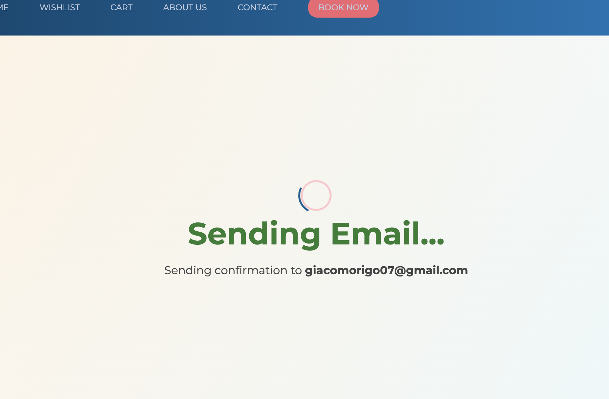

# 🌍 Travel - CAPSTONE PROJECT ✈️🏡

**Travel** is a full-stack web application inspired by Airbnb, where users can **book accommodations** around the world, manage their listings, and explore curated travel destinations. The project is divided into a **React-based frontend** and an **ASP.NET Core 8 backend** with **Entity Framework Core** and **SQL Server**.

---

## 🚀 Project Setup

### 🛠️ Backend (ASP.NET Core 8 + EF Core)

- **IDE**: Visual Studio Code  
- **Language**: C#  
- **Framework**: ASP.NET Core 8  
- **Database**: SQL Server  
- **ORM**: Entity Framework Core (with NuGet packages for SQL Server, FluentEmail, etc.)

#### 🔧 Getting Started

1. **Update the Connection String**  
   Before running the application, update the connection string in the `appsettings.json` file with your local SQL Server connection string.

2. **Run the SQL Script to Seed the Database**  
   Execute the SQL script located in the main project folder named `SQLQueryTravelApi1.sql`. This script will populate the database with the necessary initial data.

3. **Run the Application**

```bash
cd Travel-BE
cd TravelApi
dotnet run


> This will start the backend server at `https://localhost:5001`  (by default)..

---

### 🎨 Frontend (React + Bootstrap)

- **Language**: JavaScript (Vanilla + JSX)  
- **Library**: React  
- **Styling**: CSS, Bootstrap  
- **State Management**: Redux (with persistence)  
- **Routing**: React Router

#### 📦 Install Dependencies

```bash
cd travel-frontend
npm install
npm install bootstrap
npm install @reduxjs/toolkit react-redux
npm install react-router-dom
npm install redux-persist
```

#### ▶️ Start Frontend

```bash
cd Travel
npm run dev
```

> The frontend will be served on `http://localhost:3000` (by default).

---

## 🧩 Features Overview

### 👥 Authentication & Roles

-  User Login / Registration
-  Role-based access: **User** and **Admin**: If you create an account using the email "giacomorigo7@gmail.com" or "giacomorigo007@gmail.com", you will be authenticated as Admins and will have access to admin features such as the site's main dashboard.
-  Protected routes based on authentication  

### 🏠 User Functionality

-  Search by **city**, **dates**, **budget**: 
-  Filter results by **price**, **property type**, **beds**, and more  

-  The available accommodations for those dates will be shown!
-  Wishlist management  
-  Shopping cart for saved trips  
-  Account information management  

### 🔧 Admin Panel

-  Dashboard with full user management: You will be able to view all the accounts on the site, and if you wish, you can delete any one of them.
-  Property management: Just like with users, you will have full control over their listings as well, which you can either edit or delete.
-  Overview of all bookings and data  

### 🗂️ Listings & Search

-  Real-time filtering on results page  
-  Upload images directly from local machine: Feel free to upload a photo directly from your computer, without pasting an internet URL, so you can also see a preview of it!
-  View popular trips on the home page or change to categories like:  
  -  Budget Trips  
  -  Asian Destinations  
  -  European Getaways  
- Once the reservation is made, the accommodation will no longer be available to other users and an email will be sent to the account owner with the booking confirmation:



### ⚠️ Error Handling & Validation

-  Route protection for unauthorized access  
-  Validations on date selections and search criteria  
-  Comprehensive handling for API and client-side errors  

---

## 📚 Tech Stack

### 🖥️ Frontend

- React   
- React Router  
- Redux + Redux Persist  
- Bootstrap  
- HTML / CSS / JavaScript (Vanilla)

### 💻 Backend

- ASP.NET Core 8  (C#)
- Entity Framework Core  
- SQL Server  
- NuGet packages:  
  - Microsoft.EntityFrameworkCore 
  - FluentEmail  
  - Microsoft.AspNetCore.Identity

